# Agro Disease Predictor 🌾

> A lightweight web app combining **symptom-based crop disease prediction** with an **agricultural analytics dashboard** - yield, production, and area trends for wheat, cotton, and sugarcane. Built for smallholder farmers: no image upload, no camera, no high-bandwidth connection required.


<p align="center">
  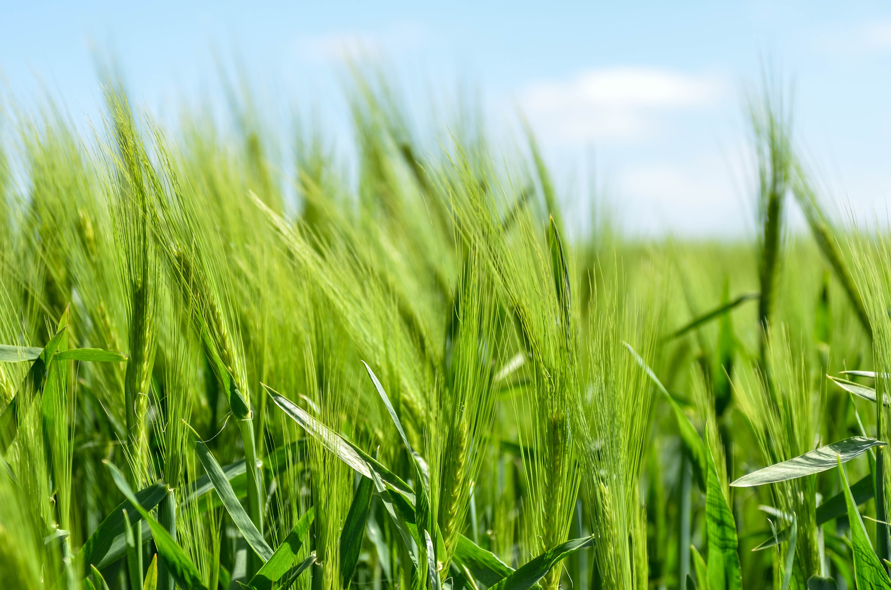
</p>

---

## 🎯 Problem

Image-based crop-disease classifiers dominate the research literature - but they assume a smartphone camera, good lighting, and a reliable internet connection. Conditions many smallholder farmers simply don't have. Meanwhile, extension officers and NGOs that support these farmers lack quick ways to cross-check suspected outbreaks against national yield and production trends.

## 💡 Solution

One lightweight Flask app with **two complementary tools**:

1. **Symptom-based disease identification** - farmers select observable symptoms (with picture references) and get the most likely disease plus suggested next steps. No image upload required.
2. **Crop analytics dashboard** - area, production, and yield trends for each supported crop, giving extension staff context for what's happening at the regional level.

Runs on feature phones, low-bandwidth links, and old laptops.

---

## ✨ Features

- 🖼️ **Visual symptom library** - each symptom comes with a reference image so farmers can match what they're seeing in the field rather than parsing unfamiliar English terms
- 🩺 **Disease identification** - CSV-backed knowledge base matches symptom combinations to the most likely disease
- 📊 **Agricultural analytics** - area, production, and yield charts per crop
- 🌾 **Three crops supported** - wheat, cotton, sugarcane (easily extensible by adding a new `<crop>_sym.csv`)
- 📶 **Zero-bandwidth-friendly** - minimal JS, server-rendered HTML, no third-party calls at runtime

---

## 🖥️ Walkthrough

### Visual symptom library
Rather than asking a farmer "does your crop have uredinia?", the app shows the actual symptom - so identification works regardless of English proficiency or agricultural vocabulary.

<p align="center">
  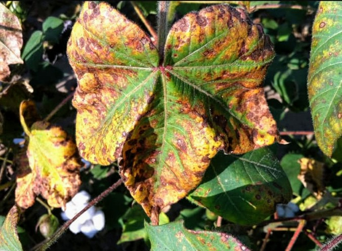
  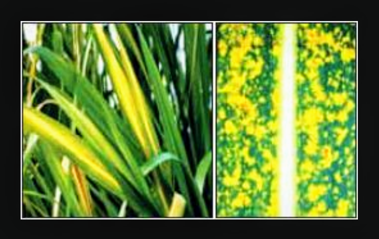
  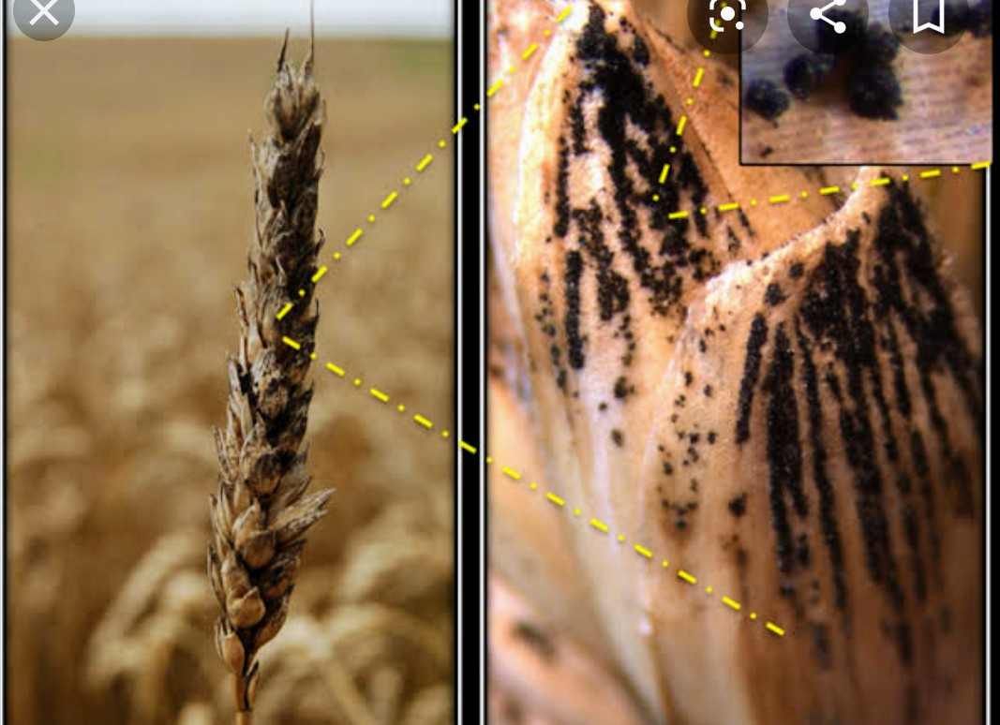
  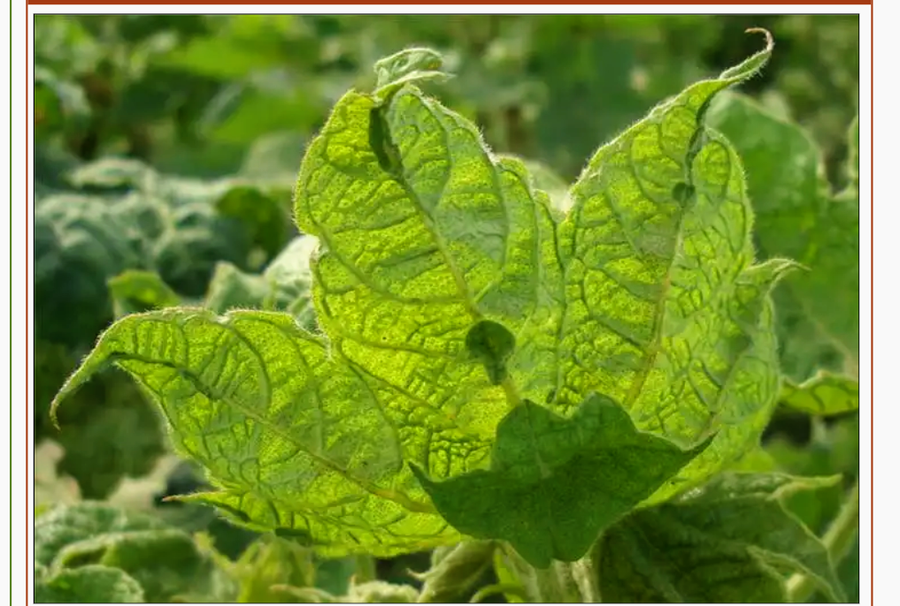
  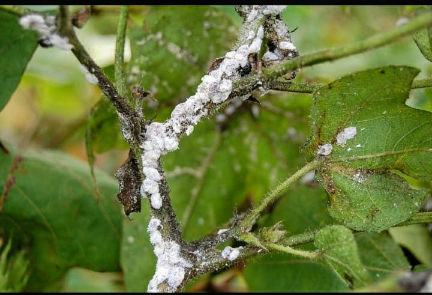
</p>

### Crop analytics dashboard
Each crop page surfaces area-under-cultivation, production, and yield trends alongside the disease tool - giving context on how the crop is doing regionally.

<p align="center">
  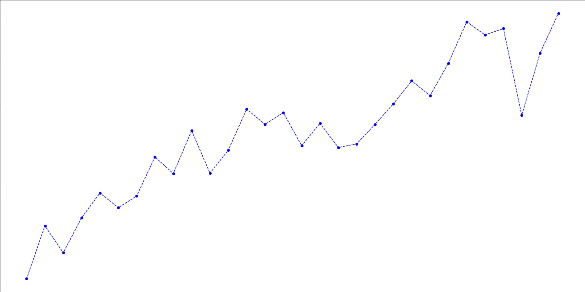
  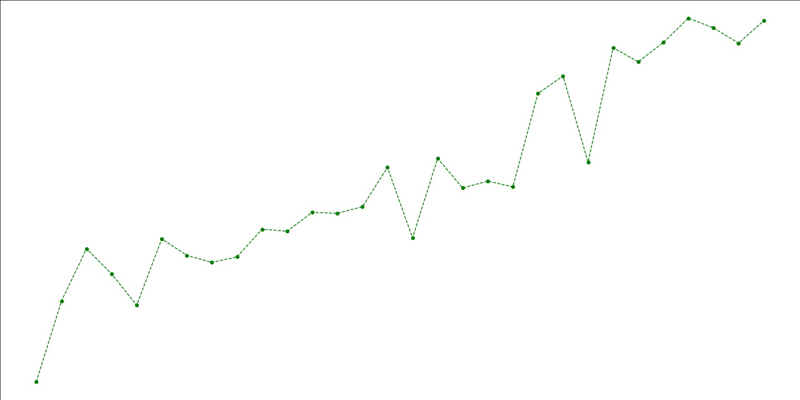
  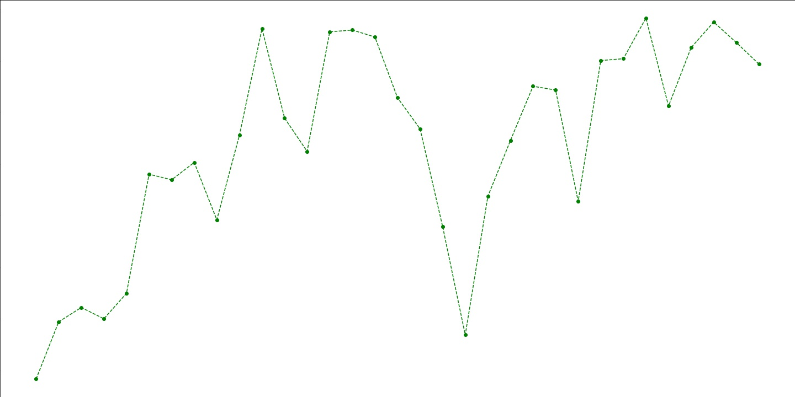
</p>

<p align="center">
  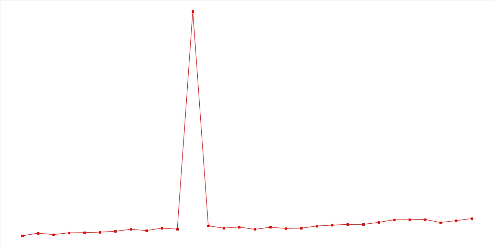
  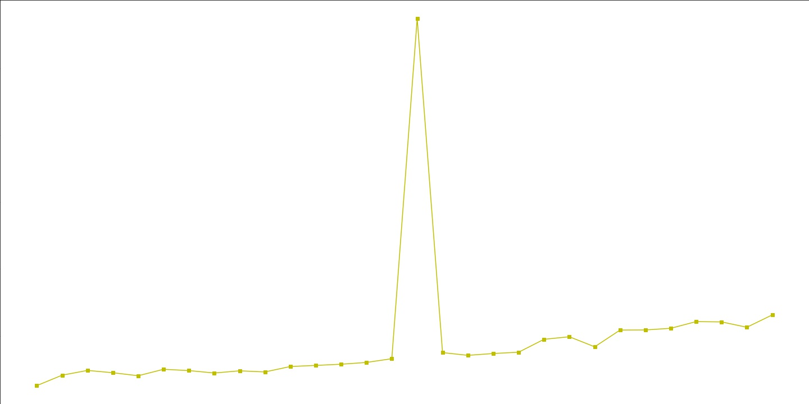
  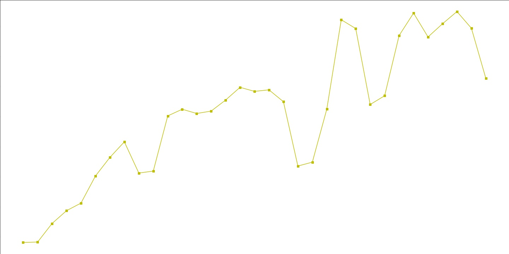
</p>

---

## 🌾 Supported Crops & Diseases

| Crop | Data source | Diseases covered |
|---|---|---|
| 🌾 **Wheat** | `wheat_sym.csv` | Rust, powdery mildew, leaf blotch, smut, and more |
| 🌱 **Cotton** | `cotton_sym.csv` | Leaf curl virus, bacterial blight, wilt, boll rot |
| 🎋 **Sugarcane** | `sugarcane_sym.csv` | Red rot, smut, mosaic, wilt |

*Add a new crop by dropping a `<crop>_sym.csv` into the repo, creating matching `templates/<crop>*.html` pages, and uploading reference images to `static/`.*

---

## 🛠️ Tech Stack

| Layer | Tools |
|---|---|
| Backend | Python 3.10+, Flask |
| Data | Pandas, CSV symptom → disease tables |
| Templating | Jinja2 |
| Frontend | HTML5, CSS3 (minimal JS, server-rendered) |
| Hosting-ready | Any WSGI host (Gunicorn, uWSGI, Render, Railway) |

## 🚀 Getting Started

```bash
# Clone
git clone https://github.com/Isha2605/Agro-Disease-Predictor.git
cd Agro-Disease-Predictor

# Install dependencies
pip install -r requirements.txt

# Run the Flask app
python main.py
```

Open `http://localhost:5000` in your browser.

## 📁 Project Structure

```
├── main.py                  # Flask entrypoint + routing
├── templates/               # Jinja2 templates
│   ├── layout.html          # Base layout
│   ├── index.html           # Home page (crop selection)
│   ├── wheat.html           # Wheat landing
│   ├── wheat_sym.html       # Wheat symptom picker
│   ├── wheat_final.html     # Wheat diagnosis result
│   ├── cotton*.html         # Cotton flow (same pattern)
│   └── sugarcane*.html      # Sugarcane flow (same pattern)
├── static/                  # Images + CSS
│   ├── agri.jpg             # Home hero
│   ├── <symptom>.png/.jpg   # Visual symptom references
│   ├── <crop>_yield.*       # Yield trend charts
│   ├── <crop>_area.*        # Cultivated-area charts
│   └── <crop>_production.*  # Production charts
├── wheat_sym.csv            # Wheat symptom → disease data
├── cotton_sym.csv           # Cotton symptom → disease data
├── sugarcane_sym.csv        # Sugarcane symptom → disease data
└── README.md
```

## 🔮 Future Work

- [ ] Train a Naive Bayes classifier on symptom–disease co-occurrence for fuzzy matching instead of rule-based lookup
- [ ] Multilingual UI (Hindi, Marathi, Telugu, Punjabi) - critical for actual farmer use
- [ ] SMS-based interface via Twilio for feature phones without browsers
- [ ] Offline Progressive Web App (PWA) with service-worker caching for zero-connectivity fields
- [ ] Expand coverage: rice, maize, tomato, pulses
- [ ] Integrate live regional weather + advisory data from IMD / state agriculture dashboards

## 📬 Contact

**Isha Narkhede** · [Portfolio](https://isha-n-portfolio.netlify.app/) · [LinkedIn](https://linkedin.com/in/isha-narkhede) · ishajayant207@gmail.com

## 📝 License

MIT - see [LICENSE](LICENSE).
